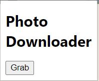

# Picture Downloader

選取並下載您想要的照片

## 安裝方法

1.將pictureDownloader下載下來。 
2.打開Chrome拓展，打開***開發人員模式***，選擇***載入未封裝項目***。 

## 使用方法

1.前往要下載圖片的網頁。 
2.點選Picture Downloader。 
***出現如下畫面***  
  
3.點選Grab，插件會尋找當前頁面的全部jpg檔，如下圖。 
 
4.將要下載圖片的右邊checkbox打勾，移到最下有download的選項，按下即可下載。 

